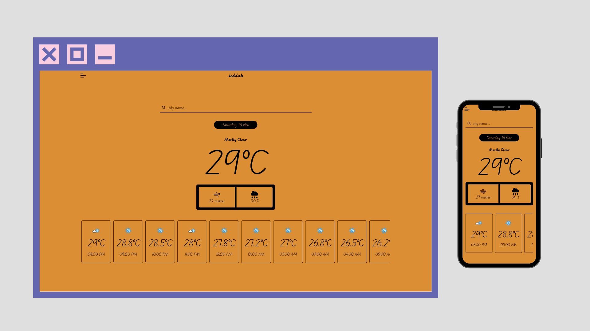

# Weather Project



## Description
This weather project fetches weather data using the [Meteosource API](https://www.meteosource.com). You can visit the live version of the project at [weather.abdullh.tech](https://weather.abdullh.tech/). For more details refer to the [docs page](https://weather.abdullh.tech/docs).

## Installation

1. **Frontend Setup:**
    - Navigate to the `client` folder:
      ```bash
      cd client/
      ```
    - Install dependencies:
      ```bash
      npm install
      ```
    - update the `REACT_APP_BACKEND_URL` in the `example.env` then:
      ```bash
      cp example.env .env
      ```
    - start the frontend:
      ```bash
      npm start
      ```

2. **Backend Setup:**
    - Navigate the root folder if you on client folder:
      ```bash
      cd ..
      ```
    - Install the dependencies:
      ```bash
      npm install
      ```
    - update the `API_KEY` in the `example.env` then:
      ```bash
      cp example.env .env
      ```
    - run the backend:
      ```bash
      npm start
      ```
